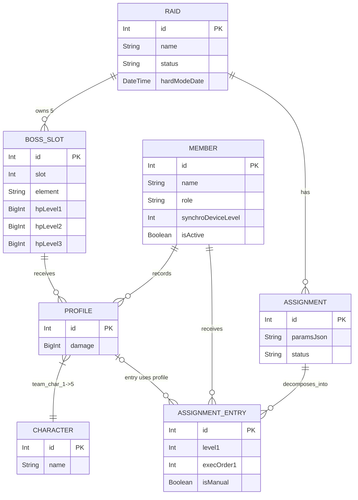

# Database Schema

The project uses SQLite through Prisma ORM, combined with the high-performance `better-sqlite3` driver. The design focuses on serving the Union Raid data flow. Below are the 6 core entity models that define the storage structure.

## 1. Core Entities

### Raid (Raid Season)
The master table representing a single Union Raid event. The `status` field can be "draft", "active", or "closed". Stores admin-written notes and the `hardModeDate` activation timestamp. All Assignment and BossSlot entities belong to a `Raid`.

### BossSlot (Boss Gate)
Each `Raid` contains up to 5 Bosses ordered by `slot` (1–5). Attributes include the `element` and an optional `displayName`. A key feature of the new DB design is recording HP values across multiple difficulty tiers (3 levels):
- `hpLevel1`
- `hpLevel2`
- `hpLevel3`

### Character (NIKKE Character)
A static lookup table (Static Seeded Enum). Contains the list of all internal NIKKE characters. Includes class, weapon, element, burst level (1, 2, 3), and manufacturer information.

### Member (Union Member)
Identity information for users. Includes:
- `name` (globally unique).
- `role`: "regular" (standard member), "finisher" (specialist for dealing finishing blows to low-HP bosses), "cleaner" (specialist for broad sweeps).
- `synchroDeviceLevel`: Current Synchro Device level.
- `isActive`: Boolean tracking whether the user is still in the Union's Discord.

### Profile (Mock Battle Record)
The central data contribution by Union Members. When a member plays a Mock Battle, they report their team (5 NIKKE `charIds`) attacking a specific boss belonging to a given `BossSlot`. Submission is tightly controlled through the Access Token system. Includes a BigInt field to accommodate extremely large `damage` values.

### Assignment & AssignmentEntry (Optimization Results)
A snapshot of the assignment results after running the optimization algorithm (ILP Solver).
- **Assignment**: Represents one assignment plan for a Raid season. Contains input parameters and a `status` indicator (draft/published).
- **AssignmentEntry**: Per-member assignment details, including:
  - 3 participating profiles (`profile1Id, profile2Id, profile3Id`).
  - Corresponding boss levels (`level1, level2, level3`).
  - Execution order (`execOrder1, execOrder2, execOrder3`).
  - An `isManual` flag marking entries manually edited by an admin (prevents overwrite when the optimizer reruns).

## 2. Simulated ERD

Below is an ERD based on the latest active Data Model from the architecture.

## 3. Useful Constraint Management

Prisma uses `ON DELETE CASCADE` for dependent relationships. When a `Raid` is deleted, all related BossSlots, Profiles, Assignments, and AssignmentEntries are automatically deleted as well. This mechanism ensures the database stays clean and no orphaned data exists.
