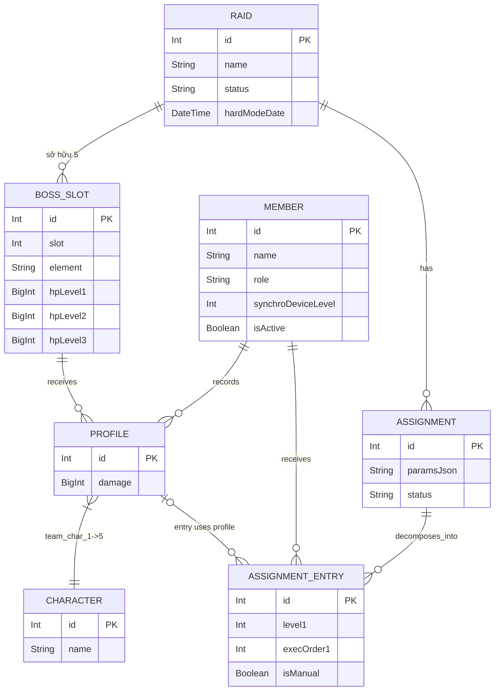

# Cơ sở Dữ liệu (Database Schema)

Dự án sử dụng SQLite thông qua Prisma ORM, kết hợp cùng driver hiệu năng cao `better-sqlite3`. Trọng tâm thiết kế phục vụ xử lý luồng dữ liệu của Union Raid. Dưới đây là 6 mô hình thực thể (Models) chủ chốt định hình cấu trúc lưu trữ.

## 1. Các Entity Chính

### Raid (Mùa Raid)
Là bảng master đại diện cho một đợt Union Raid. Trạng thái `status` có thể là "draft", "active", hoặc "closed". Lưu trữ chú thích (notes) từ admin, cùng với thời điểm kích hoạt `hardModeDate`. Tất cả các thực thể Assignment và BossSlot đều thuộc về một `Raid`.

### BossSlot (Cổng Quái Vật)
Trong mỗi `Raid`, sở hữu tối đa 5 con Boss đặt theo thứ tự `slot` (1-5). Thuộc tính bao gồm cả Yếu tố `element` và hiển thị hiển thị tên riêng `displayName`. Một cơ chế cốt yếu của DB mới là việc ghi nhận Lượng HP đa mốc (3 mức độ khó):
- `hpLevel1`
- `hpLevel2` 
- `hpLevel3`

### Character (Nhân vật NIKKE)
Bảng tra cứu tĩnh (Static Seeded Enum). Chứa danh sách các Nikke nội tại. Bao gồm class, vũ khí (Weapon), Element, cấp bậc Burst (1,2,3) và thông tin Nhà sản xuất (Manufacturer).

### Member (Thành viên Union)
Thông tin định danh của người dùng. Bao gồm:
- `name` (Duy nhất toàn cục).
- `role`: "regular" (Thành viên thường), "finisher" (Chuyên kết liễu boss HP thấp), "cleaner" (Chuyên quét diện rộng).
- `synchroDeviceLevel`: Level máy đồng bộ hiện tại.
- `isActive`: Boolean theo dõi xem người dùng có còn tồn tại trong Discord Union không.

### Profile (Ghi nhận Mock Battle)
Trung tâm thông tin dữ liệu do Union Member đóng góp. Mỗi thành viên khi chơi Mock Battle báo cáo lại đội hình (5 NIKKE `charIds`) tấn công một con boss thuộc về `BossSlot` nhất định. Quá trình kiểm soát được thắt chặt bằng hệ thống Access Token. Kèm theo một trường BigInt cho phép lưu lượng `damage` lớn khủng khiếp.

### Assignment & AssignmentEntry (Kết quả Tối ưu hoá)
Snapshot kết quả phân công sau khi chạy thuật toán tối ưu (ILP Solver).
- **Assignment**: Đại diện một kế hoạch phân công cho mùa Raid. Chứa parameters đầu vào và chỉ số `status` (draft/published).
- **AssignmentEntry**: Chi tiết phân công cho từng Member, bao gồm:
  - 3 Profile tham chiến (`profile1Id, profile2Id, profile3Id`).
  - Cấp độ Boss tương ứng (`level1, level2, level3`).
  - Thứ tự thực hiện (`execOrder1, execOrder2, execOrder3`).
  - Flag `isManual` đánh dấu entry được admin chỉnh sửa tay (không bị ghi đè khi chạy lại optimizer).

## 2. ERD Mô Phỏng 

Dưới đây là một ERD dựa trên sơ đồ Data Model thực chiến mới nhất từ kiến trúc.

## 3. Quản lý Ràng Buộc Hữu Ích

Prisma sử dụng `ON DELETE CASCADE` cho các quan hệ phụ thuộc. Khi xoá một `Raid`, toàn bộ BossSlot, Profile, Assignment và AssignmentEntry liên quan sẽ bị xoá theo. Cơ chế này đảm bảo database luôn sạch sẽ và không tồn tại dữ liệu mồ côi.
